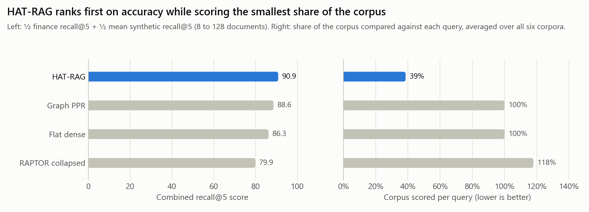
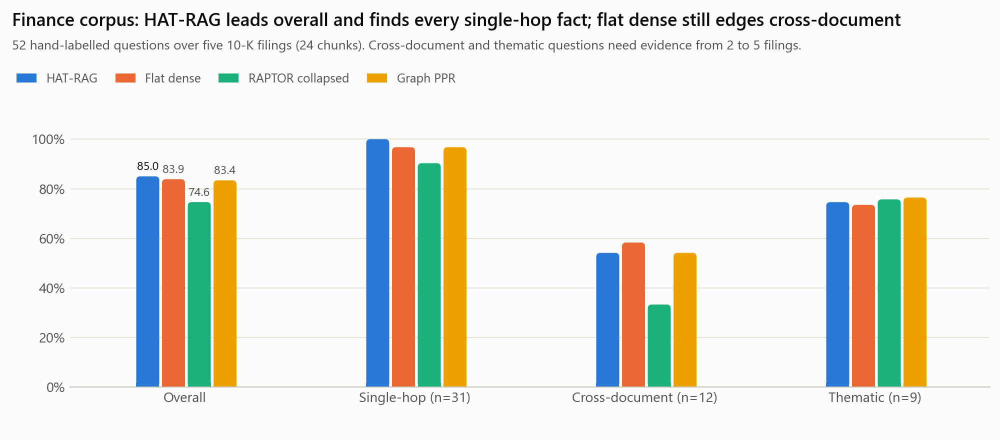
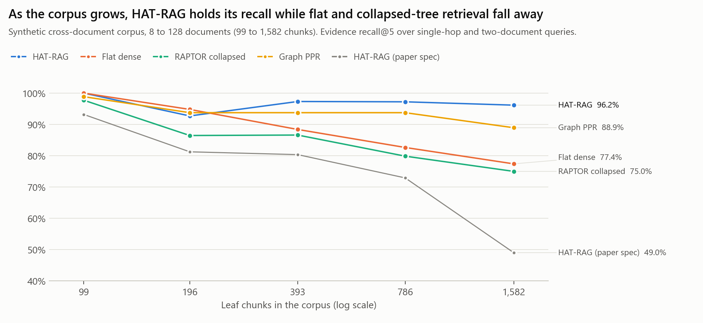
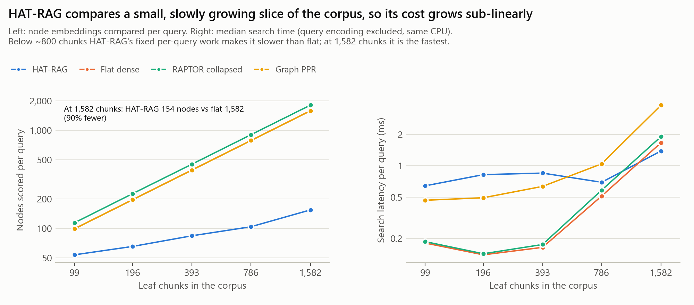
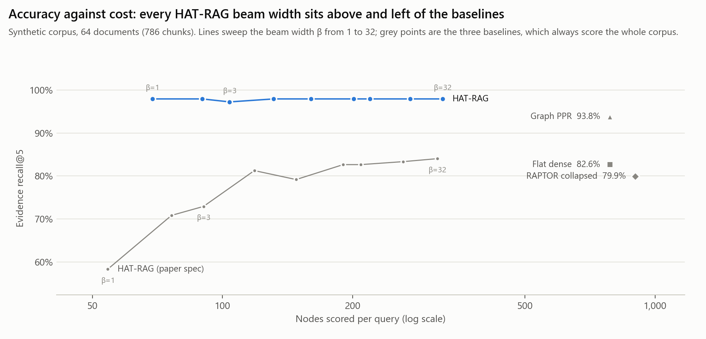
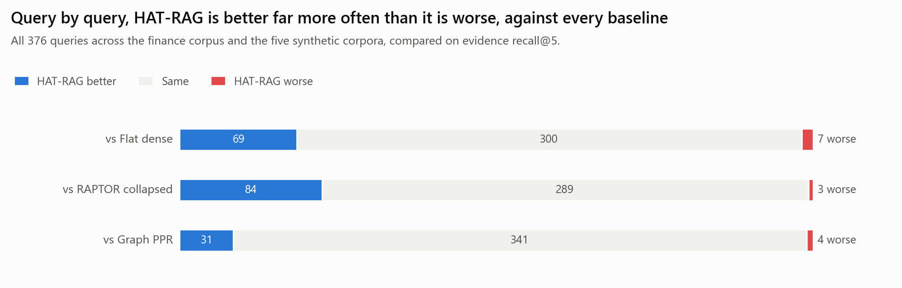
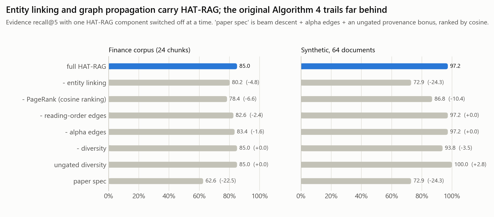

# Retrieval Algorithm Comparison

Four retrieval techniques were built over the same Hierarchical Abstract Tree and
evaluated on the same queries:

| # | File | Technique | Family |
|---|---|---|---|
| 1 | [`retrieval1_hat_beam_traversal.py`](../retrieval1_hat_beam_traversal.py) | **HAT-RAG**: beam descent of the tree + entity linking + personalised PageRank over the tree's own edges | ours |
| 2 | [`retrieval2_flat_dense.py`](../retrieval2_flat_dense.py) | Flat dense retrieval: cosine against every chunk | DPR / vanilla RAG |
| 3 | [`retrieval3_raptor_collapsed_tree.py`](../retrieval3_raptor_collapsed_tree.py) | Collapsed tree: every level of the tree pooled, cosine top-k | RAPTOR |
| 4 | [`retrieval4_graph_ppr.py`](../retrieval4_graph_ppr.py) | Entity graph + personalised PageRank over the whole corpus | GraphRAG / HippoRAG |

**Verdict: HAT-RAG is the best of the four.** It has the highest recall on the finance
corpus and on the scaling benchmark. It is also the only method whose cost grows
sub-linearly: at 1,582 chunks it compares 154 nodes per query where the others compare
1,582 to 1,807.



| Rank | Method | Finance recall@5 | Synthetic recall@5 (mean of 5 sizes) | Combined score | Share of corpus scored per query |
|---:|---|---:|---:|---:|---:|
| 1 | **HAT-RAG** | **85.0%** | **96.7%** | **90.9** | **39%** |
| 2 | Graph PPR | 83.4% | 93.8% | 88.6 | 100% |
| 3 | Flat dense | 83.9% | 88.6% | 86.3 | 100% |
| 4 | RAPTOR collapsed | 74.6% | 85.1% | 79.9 | 118% |

The ranking rule was written into `run_comparison.py` before the final run: the score is
½ × finance recall@5 + ½ × mean synthetic recall@5, and any two methods within one point
of each other are ordered by cost. HAT-RAG leads by 2.3 points, so the cost tie-break
was never needed.

---

## What the evidence shows

1. **On the finance filings, HAT-RAG is first, by a small margin.** Its recall is
   85.0% against 83.9% (flat) and 83.4% (graph), and it finds every single-hop fact
   (31/31). On this 24-chunk corpus, though, the margin is only a few queries: against
   flat dense it is better on 6 queries and worse on 5. Flat dense is still better on
   cross-document questions (58.3% vs 54.2%).
2. **As the corpus grows, HAT-RAG keeps its accuracy and the others do not.** From 99
   to 1,582 chunks, flat dense falls from 100% to 77.4% and RAPTOR from 97.7% to 75.0%.
   Graph PPR falls from 98.9% to 88.9%, while HAT-RAG stays between 92.7% and 100%
   (96.2% at the largest size).
3. **HAT-RAG is the only sub-linear method.** The number of nodes it scores grows from
   54 to 154 while the corpus grows 16×. At 1,582 chunks that is 90% fewer than flat
   retrieval, and it is also the fastest method there (1.39 ms vs 1.67 ms flat,
   3.83 ms graph).
4. **Across all 376 queries, HAT-RAG is better far more often than it is worse:**
   69 vs 7 against flat dense, 84 vs 3 against RAPTOR, and 31 vs 4 against graph PPR.
5. **The original Algorithm 4 from the paper ranked last** (62.6% on finance, 49.0% at
   1,582 chunks). The version that won is what that design became after the comparison
   exposed why it failed (see [How HAT-RAG got here](#how-hat-rag-got-here)).

---

## Setup

**Shared index.** Every method reads one `TreeIndex` built from the Algorithm 3 tree. All
four use the same chunks (Algorithm 1), the same encoder (`all-MiniLM-L6-v2`, d = 384) and
the same vectors. Each query is encoded once and handed to every method, so latency
measures search alone. Flat dense and graph PPR use only the leaves; RAPTOR and HAT-RAG
also use the abstract nodes.

**Benchmark A: finance corpus.** These are the five 10-K summaries in
[`finance_data/reports/`](../../finance_data/reports/) and the tree that
`run_finance_rag.py` built from them (24 chunks, 32 nodes, BART abstracts). It has 52
hand-labelled questions in [`finance_queries.json`](finance_queries.json):

- 31 single-hop questions, e.g. *"What were Apple's diluted earnings per share?"*
- 12 cross-document questions, e.g. *"Compare the R&D spending of Apple and NVIDIA."*
- 9 thematic questions spanning 2–5 filings, e.g. *"Which companies use FIFO to value
  inventory?"*

**Benchmark B: synthetic scaling.** This uses the paper's cross-document generator
([`synthetic_corpus.py`](synthetic_corpus.py)) at 8, 16, 32, 64 and 128 documents (99 to
1,582 chunks). It has single-hop questions and two-document questions whose second
document is linked only through a bridge sentence. A fresh tree is built at each size
(b = 8, extractive abstracts). The finance corpus is too small for cost differences to
appear, which is why this benchmark exists.

**Gold matching (strict).** A gold fact is found when a retrieved node belongs to the
right filing and its *own* text contains at least 60% of the fact's key terms, such as
`"6.13"` or `"FIFO basis"`. Returning the right company's wrong paragraph does not count,
and an abstract node gets no credit for text that only its children contain.

**Metrics.**

| Metric | Definition |
|---|---|
| Recall@5 (primary) | Fraction of a query's gold facts present in the top 5 |
| Hit@5 | At least one gold fact present |
| All gold found | Every gold fact present, i.e. the question is answerable |
| MRR | 1 / rank of the first correct node |
| Filing coverage | Fraction of the gold filings represented in the top 5 |
| Precision | Fraction of the top 5 that come from a gold filing |
| Nodes scored | Embeddings compared against the query: the cost measure |
| Latency | Median search time over 7 runs, query encoding excluded, CPU |

**Settings.** k = 5 for every method. HAT-RAG uses the paper's β = 3 and λ = 0.15 with no
tuning. Graph PPR uses damping 0.5 (the HippoRAG default), a semantic edge threshold of
0.45 with the top 4 neighbours, and reading-order edges.

---

## Results

### Finance corpus



| Method | Recall@5 | Hit@5 | All gold found | MRR | Precision | Nodes scored | Latency (ms) |
|---|---:|---:|---:|---:|---:|---:|---:|
| **HAT-RAG** | **85.0%** | **90.4%** | **78.8%** | 0.660 | 67.7% | 23.9 | 0.295 |
| Flat dense | 83.9% | 90.4% | 75.0% | 0.677 | 62.3% | 24.0 | 0.085 |
| RAPTOR collapsed | 74.6% | 76.9% | 69.2% | 0.600 | **80.4%** | 32.0 | 0.086 |
| Graph PPR | 83.4% | 90.4% | 75.0% | **0.678** | 64.6% | 24.0 | 0.204 |
| *HAT-RAG (paper spec)* | *62.6%* | *67.3%* | *55.8%* | *0.568* | *39.6%* | *23.3* | *0.047* |

| Method | Single-hop (31) | Cross-document (12) | Thematic (9) |
|---|---:|---:|---:|
| **HAT-RAG** | **100.0%** | 54.2% | 74.6% |
| Flat dense | 96.8% | **58.3%** | 73.5% |
| RAPTOR collapsed | 90.3% | 33.3% | 75.7% |
| Graph PPR | 96.8% | 54.2% | **76.5%** |

What drives the finance numbers:

- **The hard case is that most chunks never name their company.** Apple's EPS sits in a
  chunk that begins *"Total operating expenses were $54,847 million…"*, so a dense
  retriever matches the question to the one Apple chunk that says "Apple", which is the
  revenue paragraph. HAT-RAG's reading-order edges and PageRank carry the "this is
  Apple's filing" signal from that chunk to its neighbours. That is how it reaches
  31/31 on single-hop questions.
- **RAPTOR loses on cross-document questions** (33.3%) because the BART abstracts
  restate the lead sentence of each cluster. Three of its five slots often go to near-
  duplicate abstracts, such as `L1_A0`, `L2_A0` and `ROOT`, all opening with Apple's
  revenue. That gives it high precision but poor recall.
- **At 24 chunks there is no cost to save.** Every method scores close to the whole
  corpus, and HAT-RAG's extra steps make it the slowest per query here (0.30 ms vs
  0.09 ms for flat).

### Scaling





Each cell shows recall@5 · nodes scored · latency:

| Method | 99 chunks | 196 chunks | 393 chunks | 786 chunks | 1,582 chunks |
|---|---:|---:|---:|---:|---:|
| **HAT-RAG** | 100.0% · 54 · 0.64 ms | 92.7% · 65 · 0.82 ms | **97.3%** · 84 · 0.85 ms | **97.2%** · 104 · 0.70 ms | **96.2%** · 154 · **1.39 ms** |
| Flat dense | 100.0% · 99 · 0.18 ms | **94.8%** · 196 · 0.14 ms | 88.4% · 393 · 0.16 ms | 82.6% · 786 · 0.51 ms | 77.4% · 1,582 · 1.67 ms |
| RAPTOR collapsed | 97.7% · 114 · 0.19 ms | 86.5% · 226 · 0.14 ms | 86.6% · 451 · 0.18 ms | 79.9% · 901 · 0.58 ms | 75.0% · 1,807 · 1.91 ms |
| Graph PPR | 98.9% · 99 · 0.47 ms | 93.8% · 196 · 0.49 ms | 93.8% · 393 · 0.63 ms | 93.8% · 786 · 1.04 ms | 88.9% · 1,582 · 3.83 ms |
| *HAT-RAG (paper spec)* | *93.2% · 51* | *81.2% · 61* | *80.4% · 75* | *72.9% · 90* | *49.0% · 135* |

Flat and collapsed-tree retrieval degrade because the synthetic corpus is built to defeat
surface similarity. Every document shares the same distractor sentences, so as documents
are added, more near-identical chunks compete for five slots. RAPTOR also pays more than
flat (|V| ≈ 1.14 N nodes per query) for no gain in accuracy, which matches the paper's
own cost analysis.

### Accuracy against cost



At 64 documents (786 chunks), every beam width from β = 1 to 32 gives HAT-RAG 97–98%
recall while it scores 69 to 323 nodes. The baselines each sit at one point: 79.9–93.8%
recall at 786 or more nodes. The paper-spec traversal needs the full β = 32 to reach
84%, which shows that the original design depended on a wide beam to make up for its
ranking.

### Query by query



| HAT-RAG vs | better | same | worse |
|---|---:|---:|---:|
| Flat dense | 69 | 300 | 7 |
| RAPTOR collapsed | 84 | 289 | 3 |
| Graph PPR | 31 | 341 | 4 |

Most of the wins come from the larger synthetic corpora. On the finance set alone the
counts are close: 6 better / 5 worse against flat, 3 / 2 against graph, and 8 / 3
against RAPTOR.

### What each HAT-RAG component contributes



| Variant | Finance | Synthetic, 64 docs |
|---|---:|---:|
| full HAT-RAG | 85.0% | 97.2% |
| − entity linking | 80.2% | 72.9% |
| − PageRank (rank by cosine) | 78.4% | 86.8% |
| − reading-order edges | 82.6% | 97.2% |
| − alpha edges | 83.4% | 97.2% |
| − diversity | 85.0% | 93.8% |
| ungated diversity | 85.0% | 100.0% |
| paper spec | 62.6% | 72.9% |

- **Entity linking and PageRank do most of the work.** Without entity linking, recall
  at 64 documents falls 24 points, because the questions name project codes that dense
  vectors barely tell apart. Ranking by cosine instead of PageRank costs 6.6 points on
  finance and 10.4 points at 64 documents.
- **Reading-order edges matter on the real filings** (−2.4 points without them), where
  the company is named only in a filing's first chunk. They don't matter on the
  synthetic corpus, where every sentence names its project.
- **Alpha edges add 1.6 points on finance** and make no difference at 64 documents.
- **Gating the diversity bonus is a precision trade-off, not a recall win.** The ungated
  bonus scores higher at 64 documents (100% vs 97.2%), but on finance it cuts precision
  from 67.7% to 62.3% by promoting filings the question never asked about. The gate was
  kept to protect single-company questions.

---

## How HAT-RAG got here

The comparison was first run with Algorithm 4 exactly as the paper specifies: beam
descent, alpha expansion, and a flat +λ bonus for any document not yet in the result
set, ranked by cosine. **It ranked last on every benchmark** (62.6% on finance).

Looking at each failing query showed two causes:

1. **The diversity bonus rewards irrelevant documents.** On finance, the cosine gap
   between the right chunk and a wrong company's chunk is often below 0.15. A flat
   bonus for "a filing not seen yet" therefore pushed NVIDIA, Microsoft and Tesla chunks
   above the Apple chunk that actually held the answer.
2. **Cosine alone cannot tie a chunk to its company or project** when the chunk never
   names it.

The graph baseline did well on exactly these queries. HAT-RAG now borrows its two
working ingredients but keeps them inside the tree:

| Step | What it does | Why it stays sub-linear |
|---|---|---|
| 1. Descend | Beam search from the root (β = 3); alpha edges let it step sideways to an abstract under another parent | Only children of the beam are scored |
| 2. Link | Leaves naming an entity the query names (ASC 842, AWS, a project code) join the pool through an inverted index | Index lookup, not a scan |
| 3. Expand | Alpha edges and reading-order edges from the strongest leaves | At most a few neighbours each |
| 4. Propagate | Personalised PageRank over the candidate subgraph only, using the tree's own edges: alpha, reading order and shared entities | The walk covers ~25–150 nodes, not the corpus |
| 5. Select | Diversity bonus, gated by how relevant each filing is | – |

β and λ were kept at the paper's values. The design was chosen after looking at the
finance corpus and the 16- and 64-document synthetic corpora, then checked on the 8-,
32- and 128-document corpora, which were not examined beforehand. It led on 32 and 128
and tied at 8 (100% for both HAT-RAG and flat). The paper-spec version remains available
as `HATBeamRetriever(index, **PAPER_SPEC)` and as `--paper-spec` on the command line.

---

## Limitations

- **The finance benchmark is small:** 24 chunks and 52 queries. HAT-RAG's 1.1-point lead
  over flat dense there amounts to one query net (6 better, 5 worse), so on finance
  alone the top three methods are statistically level. The overall verdict rests on the
  scaling benchmark, where the gaps reach 7–19 points.
- **The synthetic queries favour entity linking.** They name exact project codes. Graph
  PPR has the same entity linking, which makes it the fair comparison for that
  ingredient. No lexical or BM25 hybrid of flat retrieval was tested, and one would
  likely narrow the gap.
- **HAT-RAG is slower than flat retrieval on small corpora:** 0.30–0.85 ms against
  0.09–0.51 ms, from 24 up to 786 chunks. It does fixed per-query work (descent,
  linking and a small PageRank) and only becomes the fastest method at 1,582 chunks.
  All timings are single-threaded Python on CPU, and the absolute numbers would shift on
  CUDA.
- **HAT-RAG and RAPTOR need the tree,** which is built offline: 28.6 s at 1,582 chunks
  with extractive abstracts, and 23.7 s for the finance tree with BART. Flat retrieval
  needs only the embeddings.
- **The design was chosen after looking at three of the six corpora,** so those results
  carry some selection bias; the other three were held out (see above).
- **Retrieval only.** No answers were generated, so answer quality was not measured.
- **Recommended indexing fix:** prepend the company or document title to each chunk's
  embedding text in Algorithm 1/3. Most finance misses, for every method, come from
  chunks that never name their company. This would lift all four retrievers, not only
  HAT-RAG.

---

## Reproduce

```bash
python algorithms/compare-algos/run_comparison.py      # a few minutes on CPU -> results/*.json
python algorithms/compare-algos/make_figures.py        # -> figures/*.png, results/tables.md

# each retriever on its own, against the finance tree
python algorithms/retrieval1_hat_beam_traversal.py --context
python algorithms/retrieval1_hat_beam_traversal.py --paper-spec
python algorithms/retrieval2_flat_dense.py
python algorithms/retrieval3_raptor_collapsed_tree.py
python algorithms/retrieval4_graph_ppr.py
python algorithms/retrieval1_hat_beam_traversal.py --query "How does Tesla set its warranty reserves?"
```

| File | Contents |
|---|---|
| `finance_queries.json` | the 52 labelled finance questions |
| `synthetic_corpus.py` | scaling-corpus generator (adapted from the paper's benchmark) |
| `run_comparison.py` | runs every method, ablation and sweep; holds the ranking rule |
| `make_figures.py` | figures and tables from the results |
| `results/finance.json` | every finance query's retrieved nodes and metrics |
| `results/scaling.json` | the same for each synthetic size, plus beam sweeps and ablations |
| `results/verdict.json` | the ranking and the rule that produced it |
| `results/tables.md` | every number behind the figures |
